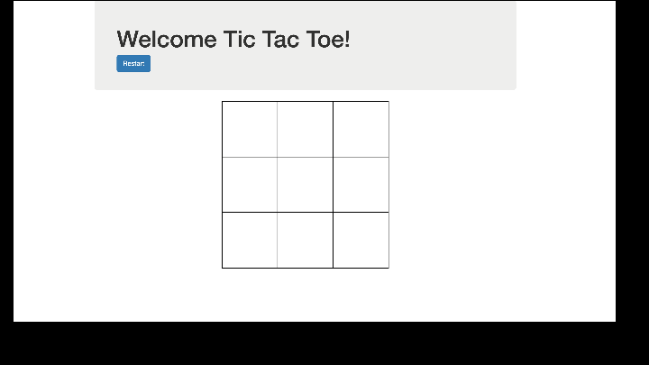

# Full-stack
Repository for full stack practice
- Adding basic code of HTML, CSS, JS and Bootstrap
# Connect Four (HTML + CSS + Bootstrap + JQuery & JS)

This project focuses on building front-end of Connect Four game using Bootstrap, CSS and HTML and the game logic using JQuery instead of using vanilla javascript

# Tic Tac Toe (HTML + CSS + Bootstrap + JS)

This project focuses on building front-end of a simple tic tac toe game using Bootstrap, css and html and has logic to mark down and erase grid cells using javascript and DOM

# CoffeeLovers Landing Page (Bootstrap + HTML)
 

 This repo focuses on the components of Bootstrap like Navbar, Jumbotron, Form, Container, and the Grid System

# Landing Page

This repo contains pure HTML and CSS stylesheet to create a static landing page that redirects to another page after the form submission.

# Practice3

This repo contains practice code for CSS (basic level)

It covers the following:
- connecting CSS styling sheet to html
- Coloring and sizing of fonts
- Styling using classes, divs, spans, and ids
- Borders
- Form get and post requests
- Scoping
- Inspecting elements and debugging

# Practice2:
This is a practice to create forms by re creating a basic sign up page.

Some of the things that are covered are:
+ use of forms
+ use of labels
+ use of input with radio, text, picture etc.
